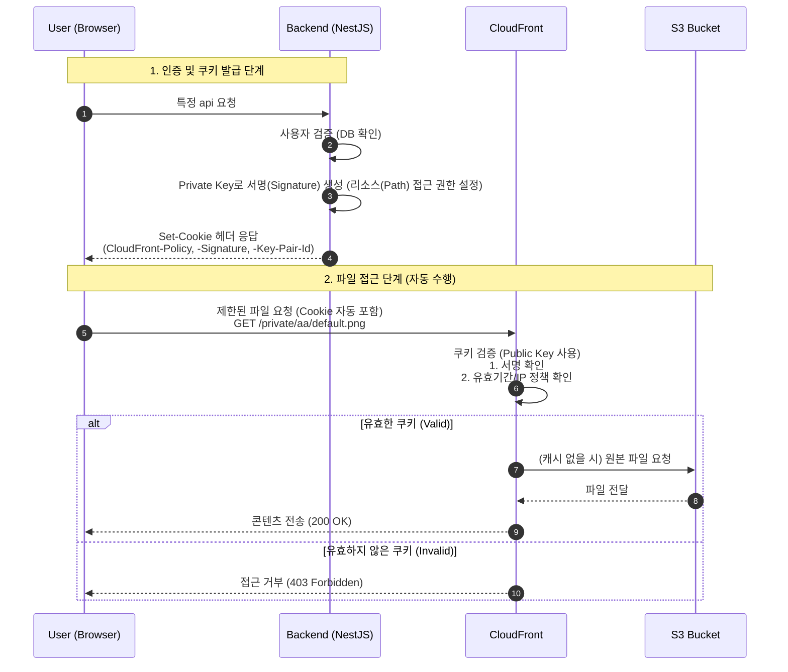
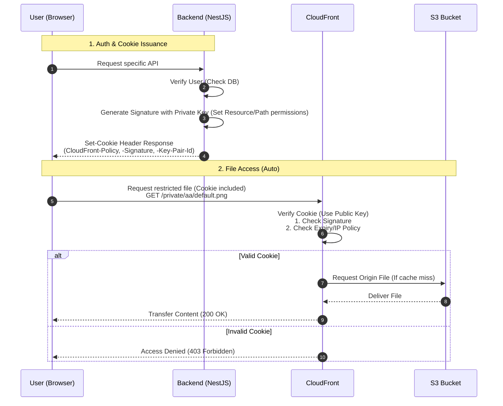

---
title:
  ko: "CloudFront + S3 Signed Cookie 환경에서 CORS 에러 완벽 해결하기"
  en: "Solving CORS Errors in CloudFront + S3 with Signed Cookies"
excerpt:
  ko: "CloudFront 의 Signed Cookie 방식을 채택했을때 발생한 CORS 트러블 슈팅에 대해서 얘기해보겠습니다."
  en: "I will discuss the CORS troubleshooting process encountered when adopting CloudFront Signed Cookies."
date: "2026-01-13"
category:
  ko: "Infra"
  en: "Infra"
tags: ["Infra", "Backend", "AWS", "S3", "Bucket", "CloudFront", "Caching", "CORS", "Signed Cookie"]
slug: "cloudfront-cors"
---

# CloudFront 란
CloudFront 는 **AWS 에서 제공하는 CDN 서비스** 입니다. **캐싱**을 사용하여 전세계에서 빠르게 파일을 빠르게 받아 볼 수 있습니다. 즉, **물리적 거리로 인한 문제를 극복** 할 수 있습니다.

<br>

# 메커니즘
먼저 **cloudfront 는 S3 를 감싸면서 동작**합니다. 즉 **요청 ⇒ CloudFront ⇒ S3 ⇒ CloudFront ⇒ 응답** 순으로 진행이 됩니다.

만약 Signed Cookie 방식을 사용한다면 다음과 같이 동작하게 됩니다.



<br>

# 트러블 슈팅
CloudFront 세팅하면서 각기 다른 이슈였지만 브라우저에서 CORS 에러를 받으면서 많이 헤맸었고, 그 경험을 작성해볼려 합니다.

먼저 cloudfront 는 `https://dev.cloudfront.junlog.dev` 로 설정하였고, 사용하는 페이지는 `https://dev.junlog.dev` 입니다.
백엔드는 `https://dev.junlog.dev` 이었고 내부 코드는 아래와 같았습니다.

```typescript
// CloudFrontService
@Injectable()
export class CloudFrontService {
  private readonly domain = process.env.CLOUDFRONT_DOMAIN;
  private readonly keyPairId = process.env.CLOUDFRONT_KEY_PAIR_ID;
  private readonly privateKey = process.env.CLOUDFRONT_PRIVATE_KEY;

  async generateSignedCookies(basePath: string, expiresInMs: number = 100000) {
    // S3 + CloudFront Signed Cookies 사용 (모든 환경)
    const url = `${this.domain}/${basePath}/*`;
    const expiry = Math.floor((Date.now() + expiresInMs) / 1000);

    const policy = JSON.stringify({
      Statement: [
        {
          Resource: url,
          Condition: {
            DateLessThan: { 'AWS:EpochTime': expiry },
          },
        },
      ],
    });

    return getSignedCookies({
      policy,
      keyPairId: this.keyPairId!,
      privateKey: this.privateKey!,
    });
  }
}

// Service
const expiresInMs = 100000;
const cookies = await this.cloudFrontService.generateSignedCookies(basePath, expiresInMs);

res.cookie('CloudFront-Policy', cookies['CloudFront-Policy'], {
  httpOnly: true,
  secure: true,
  sameSite: 'lax' as const,
  maxAge: expiresInMs,
  domain: '.junlog.dev',
});
res.cookie('CloudFront-Signature', cookies['CloudFront-Signature'], {
  httpOnly: true,
  secure: true,
  sameSite: 'lax' as const,
  maxAge: expiresInMs,
  domain: '.junlog.dev',
});
res.cookie('CloudFront-Key-Pair-Id', cookies['CloudFront-Key-Pair-Id'], {
  httpOnly: true,
  secure: true,
  sameSite: 'lax' as const,
  maxAge: expiresInMs,
  domain: '.junlog.dev',
});
```
여기를 보시면 **domain: `.junlog.dev` + sameSite: ‘lax’ 조합**으로 strict 하게 가져갔습니다.
제가 에러가 난 부분은 다음과 같습니다.

<br>

## 쿠키 도메인 설정 오류와 CloudFront의 에러 응답 시 CORS 헤더 누락

### **[원인]**

**A. 쿠키 도메인 유효 범위(Scope) 설정 오류**
* **상황:** 백엔드는 `localhost`, 프론트엔드는 `https://local.junlog.dev` 환경에서 실행 중이었습니다.
* **원인:** 백엔드에서 발급한 Signed Cookie의 `Domain` 속성이 `.junlog.dev`로 설정되어 있었으나, `localhost`에서는 해당 도메인의 쿠키를 설정(`Set-Cookie`)하거나 전송할 수 없었습니다. 그 결과, 클라이언트 요청에 인증 쿠키가 포함되지 않았습니다.

**B. CloudFront 에러 응답의 CORS 헤더 부재 (The "Red Herring")**
* **현상:** CloudFront는 요청에 필수 쿠키가 없으므로 `403 Forbidden`을 리턴했습니다.
* **문제:** CloudFront가 `403` 에러 페이지를 반환할 때, 설정된 CORS 헤더(`Access-Control-Allow-Origin` 등)를 포함하지 않고 응답을 보냈습니다.

**C. 브라우저의 에러 해석 (CORS Error Priority)**
* **결과:** 브라우저는 `403`이라는 HTTP 상태 코드보다 **응답 헤더에 CORS 허용 정보가 없다**는 사실을 먼저 처리합니다. 이로 인해 실제 원인인 **권한 없음(403)** 대신 **CORS 정책 위반(Network Error)** 으로 에러가 마스킹되어 디버깅에 혼란을 주었습니다.

<br>

### **[해결 방안]**

**백엔드 HTTPS 및 도메인 일치화**
백엔드 개발 환경을 `https://local.junlog.dev:3001`로 변경하여 프론트엔드와 동일한 상위 도메인(`junlog.dev`)을 공유하도록 조치했습니다. 이를 통해 브라우저가 정상적으로 쿠키를 저장하고 CloudFront로 전송하게 되어 문제가 해결되었습니다.


<br>

---

## CORS 잘못된 이해와 설정
위에서 언급한대로 요청에 쿠키가 잘 가는 것을 확인했고, 응답이 200 OK 지만 CORS 에러가 발생했습니다. curl 로 요청했을때 잘 받아오는 것을 확인했고 이번에는 진짜 cors 에러인 것을 확인할 수 있었습니다.

### [원인]
가장 큰 원인은 CloudFront가 S3로 요청을 보낼 때 Origin 헤더를 제거했기 때문입니다. 구체적인 발생 과정은 다음과 같습니다.

* **1. Origin 헤더 누락**: CloudFront의 기본 캐시 정책(CachingOptimized)은 캐시 효율을 위해 **Origin 헤더를 S3로 전달하지 않습니다.**
* **2. S3 CORS 미작동**: S3는 Origin 헤더가 들어와야만 CORS 규칙을 검사합니다. 헤더가 없으니 S3는 이를 일반 요청으로 취급하여 CORS 관련 헤더 없이 응답했습니다.
* **3. 잘못된 헤더 반환**: S3가 CORS 헤더를 주지 않자, CloudFront는 설정된 응답 헤더 정책(CORS-With-Preflight)에 따라 기본값인 와일드카드(Access-Control-Allow-Origin: *)를 붙여서 클라이언트에게 반환했습니다.
* **4. 브라우저 차단**: Signed Cookie를 사용하는 요청은 자격 증명(Credential)이 포함되어 있습니다. 브라우저 보안 정책상 자격 증명이 있는 요청에 대해 와일드카드(*) 응답은 허용되지 않으므로, 최종적으로 CORS 에러가 발생했습니다.

<br>

### [해결 방안]

먼저 제대로 된 해결을 하기 위해 공식 문서를 먼저 읽었고, 아래의 설정과 같이 진행했습니다.


* **원본 요청 정책**: CORS-S3Origin 으로 선택 ( **Origin 전달** )
* **응답 헤더 정책**: CORS-With-Preflight 으로 선택 ( **헤더에 Access-Control-Allowed-Origin 허용** )


```json
[
    {
        "AllowedHeaders": [
            "*"
        ],
        "AllowedMethods": [
            "GET",
            "HEAD"
        ],
        "AllowedOrigins": [
            "https://local.junlog.dev:3000"
        ],
        "ExposeHeaders": [],
        "MaxAgeSeconds": 3000
    }
]
```

* **S3 Bucket ⇒ 권한 ⇒ CORS 설정**: 위 코드와 같이 AllowedOrigin 설정

위 3가지가 핵심 설정입니다.

> 모든 설정 이후 꼭 CloudFront 에서 무효화를 해야합니다.


<br>


이후 캐시 삭제후 요청을 보내면 요청이 성공하는 것을 볼 수 있습니다.

<br>

# 트러블 슈팅 자세하게 파보기
먼저 Request 정책입니다.
아래 사진을 보면 원본 요청의 헤더를 다음 단계로 보내주는 역할을 합니다. 여기서 **origin** 을 넘겨주는 것을 확인할 수 있습니다.


<br>

이 정책은 어떤 헤더를 응답에 넣어줄지 정하는 부분입니다. 


여기서 많이 헷갈리는 부분이 S3 ⇒ CloudFront ⇒ 응답 순이라 **당연히 덮어 씌워질거라 생각**하는데 [공식문서](https://docs.aws.amazon.com/ko_kr/AmazonCloudFront/latest/DeveloperGuide/using-managed-response-headers-policies.html#managed-response-headers-policies-cors-preflight) 에 이미 있는 경우 그 header 를 사용한다고 적혀있습니다. 


위 그림을 보시면 이미 포함이 되어 있는 header 의 경우 설정을 덮어씌우지 않는다고 적혀있습니다. 
즉, **S3 Bucket 에서 준 CORS 설정을 사용**으로써 성공적으로 응답에 도달하게 됩니다.


---language-separator---

# What is CloudFront?
CloudFront is a **CDN service provided by AWS**. By using **caching**, it allows users worldwide to download files quickly. In other words, it helps **overcome latency issues caused by physical distance**.

<br>

# Mechanism
First, **CloudFront operates by wrapping S3**. The flow proceeds in the order of **Request ⇒ CloudFront ⇒ S3 ⇒ CloudFront ⇒ Response**.

If you use the Signed Cookie method, it operates as follows:



<br>

# Troubleshooting
While setting up CloudFront, I encountered various issues that resulted in CORS errors in the browser, causing me to struggle quite a bit. I want to share that experience here.

First, CloudFront was set up as `https://dev.cloudfront.junlog.dev`, and the page using it is `https://dev.junlog.dev`.
The backend was `https://dev.junlog.dev`, and the internal code was as follows:

```typescript
// CloudFrontService
@Injectable()
export class CloudFrontService {
  private readonly domain = process.env.CLOUDFRONT_DOMAIN;
  private readonly keyPairId = process.env.CLOUDFRONT_KEY_PAIR_ID;
  private readonly privateKey = process.env.CLOUDFRONT_PRIVATE_KEY;

  async generateSignedCookies(basePath: string, expiresInMs: number = 100000) {
    // Use S3 + CloudFront Signed Cookies (All environments)
    const url = `${this.domain}/${basePath}/*`;
    const expiry = Math.floor((Date.now() + expiresInMs) / 1000);

    const policy = JSON.stringify({
      Statement: [
        {
          Resource: url,
          Condition: {
            DateLessThan: { 'AWS:EpochTime': expiry },
          },
        },
      ],
    });

    return getSignedCookies({
      policy,
      keyPairId: this.keyPairId!,
      privateKey: this.privateKey!,
    });
  }
}

// Service
const expiresInMs = 100000;
const cookies = await this.cloudFrontService.generateSignedCookies(basePath, expiresInMs);

res.cookie('CloudFront-Policy', cookies['CloudFront-Policy'], {
  httpOnly: true,
  secure: true,
  sameSite: 'lax' as const,
  maxAge: expiresInMs,
  domain: '.junlog.dev',
});
res.cookie('CloudFront-Signature', cookies['CloudFront-Signature'], {
  httpOnly: true,
  secure: true,
  sameSite: 'lax' as const,
  maxAge: expiresInMs,
  domain: '.junlog.dev',
});
res.cookie('CloudFront-Key-Pair-Id', cookies['CloudFront-Key-Pair-Id'], {
  httpOnly: true,
  secure: true,
  sameSite: 'lax' as const,
  maxAge: expiresInMs,
  domain: '.junlog.dev',
});
```

As you can see, I applied a strict configuration with **domain: `.junlog.dev` + sameSite: ‘lax’**.
Here is where I faced errors.

<br>

## Cookie Domain Mismatch & CloudFront Error Response without CORS Headers

### **[Cause]**

**A. Cookie Domain Scope Configuration Error**
* **Situation:** The backend was running on `localhost`, and the frontend on `https://local.junlog.dev`.
* **Cause:** The Signed Cookie issued by the backend had its `Domain` attribute set to `.junlog.dev`. However, `localhost` cannot set (`Set-Cookie`) or transmit cookies for that domain. As a result, the authentication cookies were not included in the client's request.

**B. Absence of CORS Headers in CloudFront Error Responses (The "Red Herring")**
* **Phenomenon:** CloudFront returned `403 Forbidden` because the request lacked the necessary cookies.
* **Problem:** When CloudFront returned the `403` error page, it sent the response without including the configured CORS headers (e.g., `Access-Control-Allow-Origin`).

**C. Browser's Error Interpretation (CORS Error Priority)**
* **Result:** The browser processes the fact that **"there is no CORS allowance info in the response header"** before the HTTP status code `403`. Consequently, the actual cause, **"Access Denied (403),"** was masked by **"CORS Policy Violation (Network Error),"** causing confusion during debugging.

<br>

### **[Solution]**

**Align Backend HTTPS & Domain**
I changed the backend development environment to `https://local.junlog.dev:3001` to share the same parent domain (`junlog.dev`) with the frontend. This allowed the browser to correctly save the cookies and send them to CloudFront, resolving the issue.


<br>

---

## Misunderstanding CORS & Configuration
As mentioned above, I confirmed that cookies were being sent correctly in the request, and the response was 200 OK, but a CORS error still occurred. When I requested via `curl`, I confirmed the data was received correctly, which meant this was a genuine CORS error.

### [Cause]
The main reason was that CloudFront stripped the Origin header when sending the request to S3. The specific process was as follows:

* **1. Origin Header Stripped**: CloudFront's default cache policy (`CachingOptimized`) **does not forward the Origin header to S3** to improve cache efficiency.
* **2. S3 CORS Inactive**: S3 only checks CORS rules when an Origin header is present. Since the header was missing, S3 treated it as a standard request and responded without CORS-related headers.
* **3. Incorrect Header Return**: Since S3 provided no CORS headers, CloudFront returned the default wildcard (`Access-Control-Allow-Origin: *`) according to its Response Headers Policy (`CORS-With-Preflight`).
* **4. Browser Block**: Requests using Signed Cookies include credentials. Browser security policies do not allow wildcard (`*`) responses for requests with credentials, so the browser blocked it, resulting in a CORS error.

<br>

### [Solution]

To resolve this properly, I read the official documentation and proceeded with the following settings:


* **Origin Request Policy**: Select `CORS-S3Origin` (**Forwards Origin**)
* **Response Headers Policy**: Select `CORS-With-Preflight` (**Allows Access-Control-Allowed-Origin in header**)


```json
[
    {
        "AllowedHeaders": [
            "*"
        ],
        "AllowedMethods": [
            "GET",
            "HEAD"
        ],
        "AllowedOrigins": [
            "https://local.junlog.dev:3000"
        ],
        "ExposeHeaders": [],
        "MaxAgeSeconds": 3000
    }
]
```

* **S3 Bucket ⇒ Permissions ⇒ CORS**: Set `AllowedOrigins` as shown in the code above.

These three settings are the core configuration.

> **Note:** You must perform an invalidation in CloudFront after applying all settings.


<br>


After clearing the cache, you will see that the requests succeed.

<br>

# Deep Dive into Troubleshooting
First, let's look at the Request Policy.
The image below shows the role of forwarding the headers of the original request to the next stage. You can verify here that it forwards the **origin**.


<br>

This policy defines which headers to include in the response.


A common point of confusion here is thinking that since the flow is S3 ⇒ CloudFront ⇒ Response, the settings will **naturally be overwritten**. However, the [official documentation](https://docs.aws.amazon.com/AmazonCloudFront/latest/DeveloperGuide/using-managed-response-headers-policies.html#managed-response-headers-policies-cors-preflight) states that if the header is already present, it is used.


As shown in the image above, it states that if the header is included in the origin response, the policy does not overwrite it.
In other words, by **using the CORS settings provided by the S3 Bucket**, the correct headers successfully reach the response.